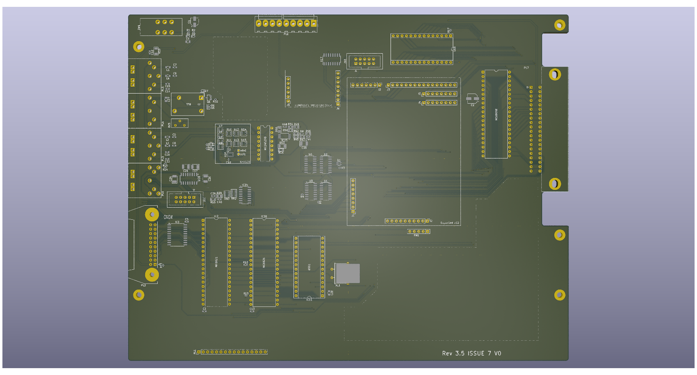

# DRAGON 32 CPU Rev 3(.5) #

This project contains the design for a hugely upgraded version
of the Dragon 32 (technically a Dragon 64 for pedants)

The basis of the design is the Dragon 32 recreation that I have
been refining for some time. The peripheral IO remains as originally
specified by Dragon Data but the ram, address multiplexer and video
display generator or implemented on a separate plug-in component.

Technically the original ICs could be implemented on the plug-in and
you would be left with an original piece of hardware (in terms of
function). I already have a board for that though...

The benefit of the plugin board is to implement the complex (and
expensive) fabrication on a smaller device and abstract away the
upgrades that are contained.

Almost every passive component and supporting logic ICs have been
switched to surface mount technology. This means the board can be
part assembled at relatively low cost, leaving just the major ICs,
ports, connectors and relay to be hand assembled.

## Modifications ##
### Joysticks ###

The two joystick ports provide a second fire button capability
wired to consecutive keyboard rows, as per the Tandy CoCo. 
Unless a two button joystick is used this make no difference to
the operation of the computer. It also requires the use of 6-pin 
DIN sockets, these are pin compatible with the 5-pin originals
so a regular single button joystick can still be used.

The two extra buttons can also be disabled by omitting L3 and L4

## License

This project and all its hardware design are licensed under
creative commons [CC BY-NC 4.0](https://creativecommons.org/licenses/by-nc/4.0/deed.en)

__You are free to:__

Share - copy and redistribute the material in any medium or format

Adapt - remix, transform, and build upon the material

The licensor cannot revoke these freedoms as long as you follow the 
license terms.

__Under the following terms:__

Attribution - You must give appropriate credit, provide a link to the 
license, and indicate if changes were made. You may do so in any 
reasonable manner, but not in any way that suggests the licensor 
endorses you or your use.

NonCommercial - You may not use the material for commercial purposes.
